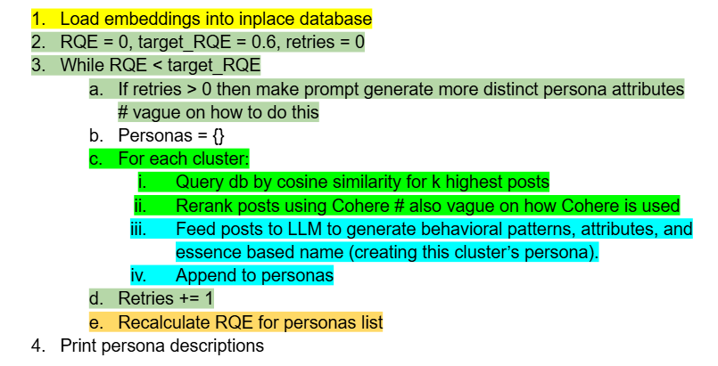

# proj-sim

> **Behavioural agent profiles** — Extracting agent persona archetypes from real large systems data, for deployment in behaviourally-grounded large system simulations.

---

## Draught Architecture

```
Moltbook (3.1M posts)                    MiroFish simulation
  ↓                                            ↓
MiniLM 384-D embeddings             GraphRAG → entity graph
  ↓                                            ↓
k-means archetypes          →       NL persona descriptions
  ↓                                            ↓
representative posts        →       agent personas + memories
                                             ↓
                                        simulation engine
```

The persona extraction pipeline produces the parameterisations for downstream simulators.

---

## Current Progress

We conduct a full replication of 

Amin et al., 2026. _How to Model AI Agents as Personas?: Applying the Persona Ecosystem
Playground to 41,300 Posts on Moltbook for Behavioral Insights_: https://arxiv.org/pdf/2603.03140

### Stage 1 — Embedding
```
SimulaMet/moltbook-observatory-archive dataset (3.1M posts)
  → text cleaning
  → MiniLM-L6-v2 384-D on GPU
  → moltbook_embeddings.npy (3105136, 384)
```

### Stage 2 — Clustering
```
moltbook_embeddings.npy
  → Sweep for optimal silhouette score on subsample using MiniBatchKMeans efficient KMeans algorithm
  → cluster_labels.npy, cluster_centroids.npy
```

### Stage 3 — Representative Post Retrieval
```
centroids of clusters → cosine similarity → top-N posts per cluster
  → cluster_k_posts.txt
```

### Stage 4 — Persona Generation

```
Pseudocode showing RAG pipeline (clusters -> persona descs.)

cluster_k_posts.txt → MiroFish GraphRAG pipeline
  → entity graph per cluster
  → NL persona descriptions
  → MiroFish simulation
```

---

## Next steps on amin-preprocessing-replication branch

Comments from peer-review:
- [ ] Better check for alignment, based on hashes? rather than length
- [x] Fast LangDetect worth adding? Does it overcome anything beyond GIL which is already fixed? -> yes, it's faster and more accurate, though heavier
- [x] Change date range to match Amin et al

Amin et al. missing pieces: see DFD [here](https://drive.google.com/file/d/1JKyW9sdZcWSQ44bmUfituQ8JH_eMpDWj/view?usp=sharing)

- [x] Remove the UMAP→KMeans re-cluster methods (PCA→UMAP, PCA50→UMAP, raw→UMAP). UMAP preserves local neighbourhood structure for visualization. It breaks longer distances and density to produce artifically tight clusters and can create both false tears and high densities that don't exist in the original data. KMeans on the other hand uses global distances to cluster. Correspondingly we saw kmeans on UMAP created highly unbalanced clusters, which was useless, so we deleted it.

---

## Future Directions
- [ ] Validation against Jiang et al. topic taxonomy and Stable Personas

---

## References

- Amin, D., Salminen, J., Jansen, B.J. (2026). *How to Model AI Agents as Personas?* arXiv:2603.03140
- Jiang, Y. et al. (2026). *Humans welcome to observe: A First Look at the Agent Social Network Moltbook.* arXiv:2602.10127
- Guo, H. (2025). *MiroFish: A Simple and Universal Swarm Intelligence Engine.* github.com/666ghj/MiroFish
